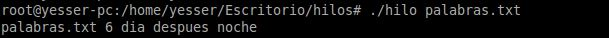
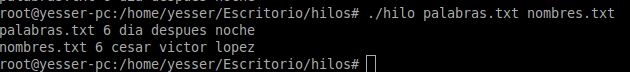

# **Resultado**
~~~
Este es el resulatado que optenemos cuando solo pasamos un fichero de texto que en este caso la palabras que mas se repite 
dentro de el es dia y a la vez para liverar memoria solo toma una en cuenta y omite las otras
~~~

~~~
Este es el resultado con dos o mas ficheros de texto
~~~

