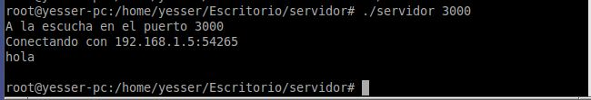
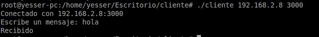

# **Resultado**
~~~
Primero en el servidor asignamos un puerto en este caso el 3000 para poder recibir el envio
~~~

~~~
En el cliente ingresamos la dirección ip del servidor mas el puerto y escribimos un mensaje
~~~

